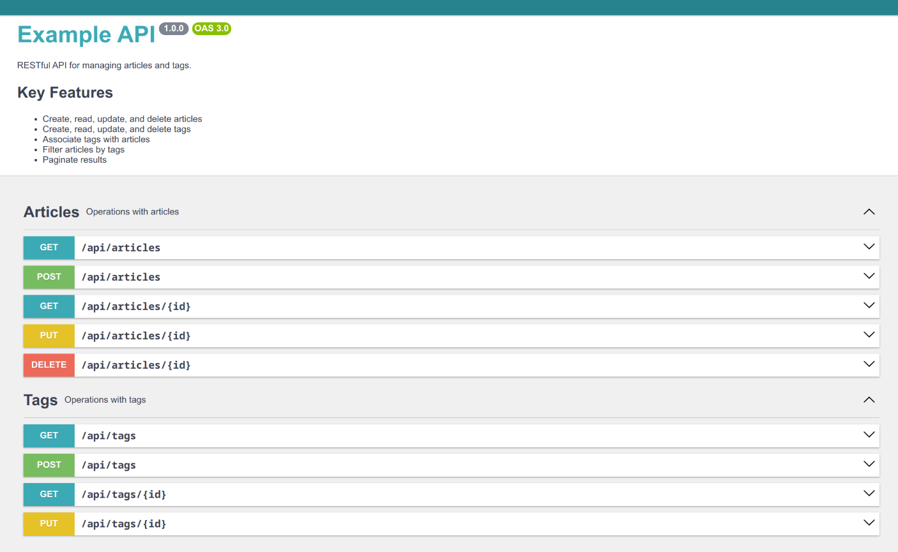

# Simple CRUD

A simple RESTful API for managing articles and tags, built with Symfony and RoadRunner.

## Technologies

- PHP 8.3
- Symfony 7.2
- RoadRunner
- MySQL 8.0
- Docker

## Architecture Approach

This project is structured with a context-based approach and follows Command Query Separation (CQS) principles. While this might seem excessive for a small application, these architectural decisions provide significant benefits:

- **Context-based Structure**: Divides the application into logical domains (Article, Tag), creating clear boundaries between different parts of the system without the full complexity of DDD.
  
- **CQS Pattern**: Separates read operations (Queries) from write operations (Commands), which:
  - Improves code readability and maintainability
  - Makes testing easier with clear input/output contracts
  - Facilitates better separation of concerns
  - Provides a natural way to implement caching strategies
  - Makes the system more extensible for future requirements
  - Reduces side effects in the codebase

This approach strikes a balance between maintainable code organization and practical implementation, preserving Symfony's autowiring capabilities while avoiding the overhead of a full DDD implementation with its complex folder structure.

## Installation and Running

```bash
# Clone the repository
git clone git@github.com:ntnchq/simple-api-test-task.git
cd simple-api-test-task

# Initialize the project (start containers, create database, apply migrations)
make init

# Run tests
make test
```

## Development Commands

The project includes several useful commands for development:

```bash
# Start containers
make up

# Stop containers
make down

# Restart containers
make restart

# Access PHP container shell
make cli

# Run tests
make test

# Create database migration diff
make mig-diff

# Apply database migrations
make mig-apply

# Reset database (drop, create, apply migrations)
make db-reset

# Run code style fixer and static analysis
make lint
```

## API Documentation

API documentation is available via Swagger UI at `/api/doc`.



## Task Description

Detailed task description can be found in [docs/task-description.md](docs/task-description.md). 